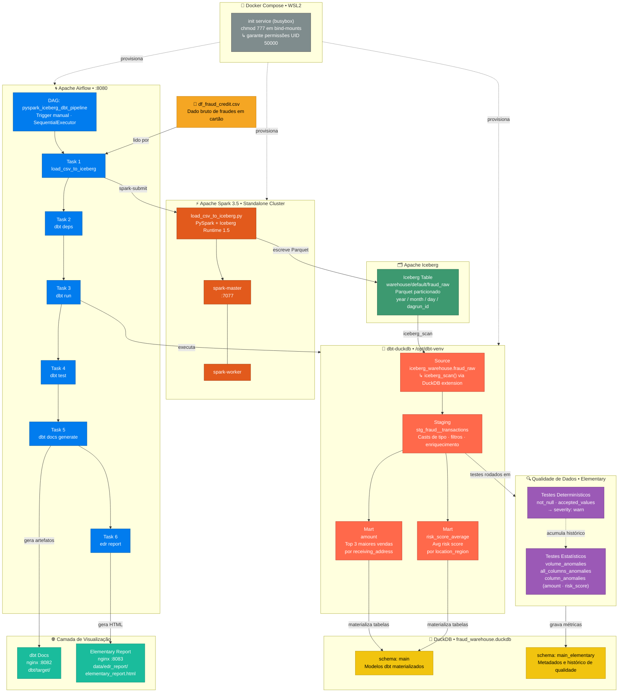

# Airflow + Spark + dbt + DuckDB — Pipeline Local

Pipeline de dados local para detecção de fraude em transações financeiras, com orquestração Airflow, ingestão PySpark/Iceberg, transformações dbt/DuckDB e monitoramento de qualidade com Elementary.

## Arquitetura da Solução



## Pré-requisitos

- Docker Desktop com integração WSL habilitada
- Docker Compose plugin instalado no WSL:
  ```bash
  sudo apt update && sudo apt install -y docker-compose-plugin
  ```
- Harlequin instalado no WSL (para consulta local ao DuckDB):
  ```bash
  pip install harlequin
  ```

## Iniciando do zero

```bash
# 1. Clone e entre na pasta
git clone <url-do-repo>
cd airflow-spark-dbt-duckdb

# 2. Suba todos os serviços (build incluso)
docker compose up -d --build

# 3. Aguarde o Airflow inicializar (~30s) e acesse
#    http://localhost:8080  (usuário: admin / senha: admin)

# 4. Ative e execute a DAG "pyspark_iceberg_dbt_pipeline" pelo UI do Airflow
```

O pipeline roda na seguinte ordem:

```
load_csv_to_iceberg → dbt_deps → dbt_run → dbt_test → dbt_docs_generate → edr_report
```

Após a conclusão, todos os dados estarão disponíveis no DuckDB e os relatórios acessíveis nas URLs abaixo.

## Interfaces disponíveis

| Interface | URL | Descrição |
|---|---|---|
| Airflow | http://localhost:8080 | Orquestração e logs de execução |
| dbt Docs | http://localhost:8082 | Lineage, descrições e testes dos modelos |
| Elementary | http://localhost:8083 | Relatório de qualidade de dados |

## Consultando os dados com Harlequin

O DuckDB gerado pelo pipeline fica em `dbt_db/fraud_warehouse.duckdb`. Para acessá-lo pelo terminal WSL:

```bash
# Modo leitura (sempre disponível — arquivo pertence ao container)
harlequin -a duckdb dbt_db/fraud_warehouse.duckdb --read-only

# Modo leitura e escrita (disponível após o próximo docker compose up)
harlequin -a duckdb dbt_db/fraud_warehouse.duckdb
```

> **Atalhos no Harlequin:** `Ctrl+Q` para sair, `Ctrl+Enter` para executar a query.

Schemas disponíveis no banco:
- `main` — modelos dbt materializados (`stg_fraud__transactions`, `amount`, `risk_score_average`)
- `main_elementary` — métricas e resultados de testes coletados pelo Elementary

## Comandos úteis

```bash
# Ver status dos serviços
docker compose ps

# Logs do Airflow em tempo real
docker compose logs -f airflow

# Reiniciar sem rebuild (preserva volumes)
docker compose down && docker compose up -d

# Rebuild completo (necessário após alterar Dockerfile ou requirements)
docker compose down && docker compose up -d --build
```

### Executar dbt manualmente (sem rodar a DAG)

```bash
# Rodar todos os modelos
docker compose exec airflow bash -lc 'cd /opt/airflow/dbt && /opt/dbt-venv/bin/dbt run --profiles-dir /opt/airflow/dbt'

# Rodar um modelo específico
docker compose exec airflow bash -lc 'cd /opt/airflow/dbt && /opt/dbt-venv/bin/dbt run --select stg_fraud__transactions --profiles-dir /opt/airflow/dbt'

# Rodar apenas os testes
docker compose exec airflow bash -lc 'cd /opt/airflow/dbt && /opt/dbt-venv/bin/dbt test --profiles-dir /opt/airflow/dbt'
```
